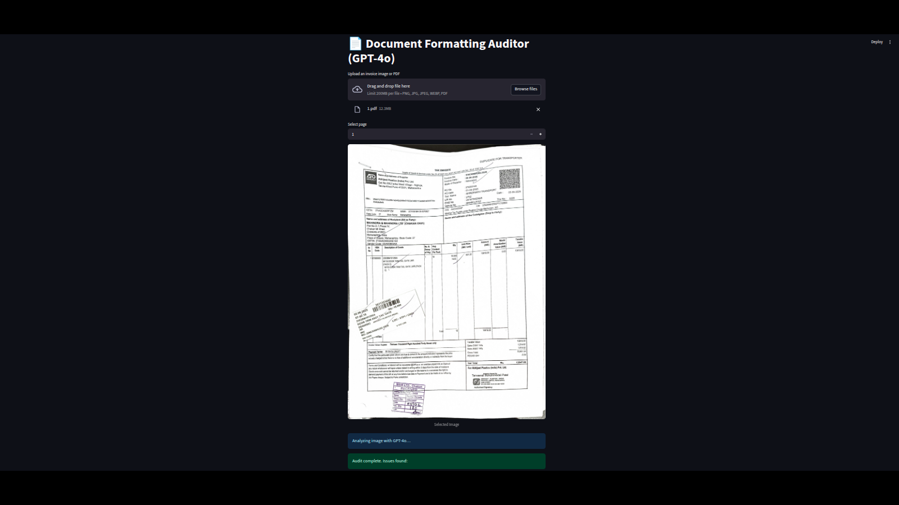
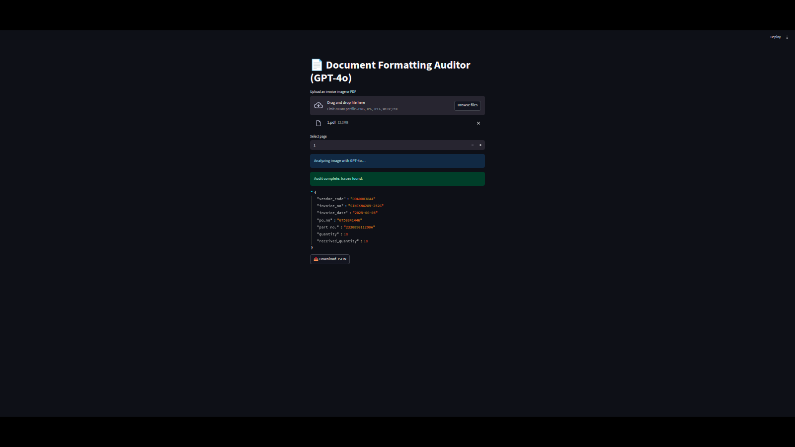

# 📄 InvoiceIQ – Intelligent Invoice Data Extraction System



---

## 🧠 Project Overview

**InvoiceIQ** is a powerful document intelligence system that performs **OCR-based data extraction** from uploaded invoices and other structured documents. It reliably parses key information such as:

- Invoice Number  
- Invoice Date  
- Vendor Code  
- PO Number  
- Item Details (Name, Quantity, Rate)  
- Total & Grand Total  
- Stamp Verification (Highly accurate)

The system is designed to **work with diverse layouts** and file formats, extracting data even from **complex or noisy documents**. A major challenge of stamp-based verification has also been successfully tackled using robust **image embedding comparisons**.

Whether the file is a scan, image, or PDF—if a human can read it, **InvoiceIQ** can parse it.

---

## 🚀 Getting Started

### 🖥 Frontend (Streamlit UI)

```bash
streamlit run app.py
````

### 🛠 Backend (FastAPI + Embedding + Utils)

```bash
# Step 1: Install requirements
pip install -r requirements.txt

# Step 2: Start the backend server
cd backend
uvicorn app:app --reload
```

The backend provides:

* OCR processing
* Image preprocessing
* Embedding-based stamp comparison
* JSON output formatting

---

## 🎥 Demo Video

⬇️ *(Demo coming soon here)*

https://github.com/user-attachments/assets/3c9cdbfc-f0f0-422c-83ac-b047b23a81b6

---

## 🔍 Features

✅ Human-readable document parsing
✅ Highly flexible input support (PDF, PNG, JPG, etc.)
✅ Strict positional & format constraints for accuracy
✅ Fast and scalable backend using FastAPI
✅ Accurate stamp detection with `text-embedding-ada-002`

---

## 🛠 Tech Stack

* **Frontend**: Streamlit
* **Backend**: FastAPI
* **OCR Engine**: Tesseract
* **Embedding**: Azure OpenAI `text-embedding-ada-002`
* **Stamp Matching**: Vector similarity + base64 image handling
* **File Types Supported**: PDF, PNG, JPG

---

## 📦 Folder Structure

```
InvoiceIQ/
│
├── app.py                  # Streamlit Frontend
├── backend/
│   ├── app.py              # FastAPI backend
│   ├── utils/              # OCR, Preprocessing, Embedding scripts
│   └── model/              # Embedding logic, Stamp comparison
│
├── public/
│   └── invoice_ui_1.png
│   └── invoice_ui_2.png
│
└── requirements.txt
```



---

## 🌍 Use Cases

* Automated invoice digitization
* Bill processing systems
* Procurement systems
* KYC or stamp-based validation systems
* Document archiving with searchable metadata

---

## 💼 Ideal For

✅ Freelance project delivery on **Upwork** / **Fiverr**
✅ AI / OCR portfolios
✅ Enterprise document processing workflows

---

## 📬 Contact

Feel free to reach out if you'd like a custom solution or integration!

---
